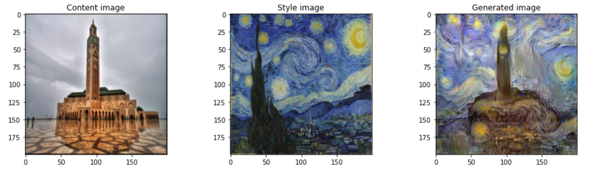
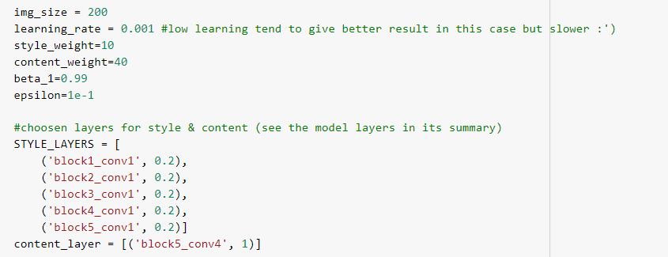

# Deep-learning-art-style-transfer

Style Transfer model built exploiting a pre-trained VGG19 model.

 

## Summary of choosen Hyperparams:

 

* small learning rates tend to give better results but slow learning (faster learnings could hurt the quality)
* training for around 200 000 epauch for a 0.001 learning rate gives good results 

## References:

Original paper: <a href="https://arxiv.org/abs/1508.06576"> A Neural Algorithm of Artistic Style (Gatys et  al.)</a> 

TensorFlow: <a href="https://www.tensorflow.org/tutorials/generative/style_transfer">https://www.tensorflow.org/tutorials/generative/style_transfer</a> 
